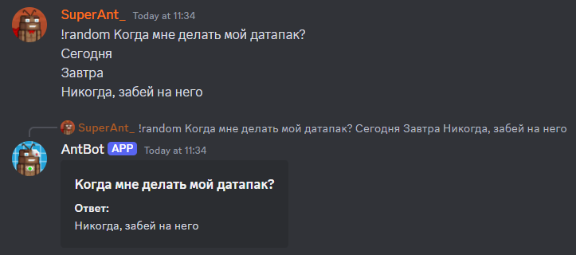
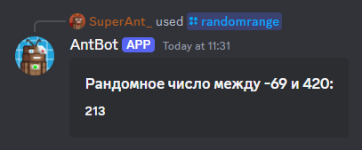
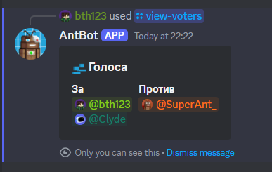
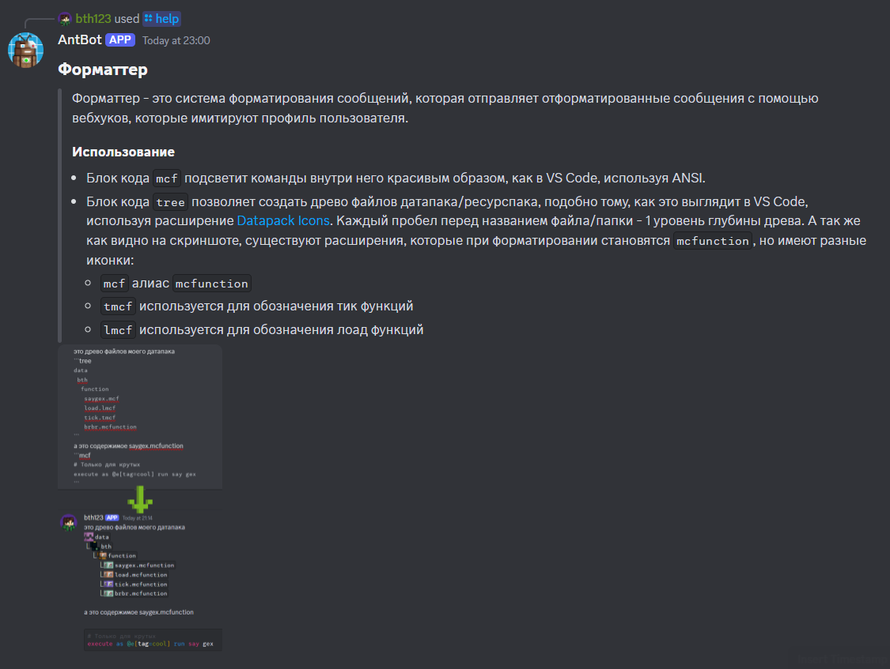
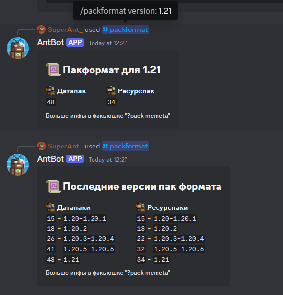
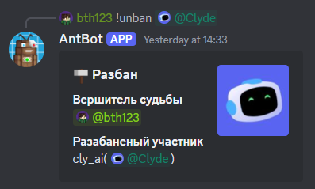

# Команды Антбота

# Админские

## status
> Меняет статус, также изменяет аватарку антбота в соответствии с установленным статусом
> ### Алиасы
> ыефегы, статус
> ### Использование
> `/status <статус>`
> ### Пример
> - `/status dnd`
> 
> 

## edit
> Редактирует сообщение антбота
> ### Алиасы
> изменить, эдит, увше
> ### Использование
> `/edit <айди сообщения|ссылка на сообщение|ответ на сообщение> <отредактированный текст>`
> ### Пример
> - `/edit 1091671717111414905 gex`
> - (С ответом на сообщение) `/edit gex`
> 
> 

## ping
> Показывает задержку антбота
> ### Алиасы
> p, latency, пинг, п, з, зштп, дфеутсн
> ### Использование
> `/ping`
>
> 

## say
> Отправляет сообщение от имени антбота
> ### Алиасы
> s, сказать, молвить, сей, сэй, ыфн, ы
> ### Использование
> `/say <текст>`

# Фановые

## enchant
> Переводит текст на язык стола зачарования (Standard Galactic Alphabet). Учтите, что если вы будете пробовать переводить кириллицу, команда сначала переведёт её в латиницу а уже потом на язык стола зачарования.
> ### Алиасы
> ench, енч, энч, зачаровать, зачарить, зачарь, зачаруй, утср, утсрфте
> ### Использование
> `/enchant <текст>`
> ### Пример
> `/enchant калдун это выдуманная абстрактная фигура, состоящая из 10 рублей`
> 
> 

## unenchant
> Переводит текст с языка стола зачарования (Standard Galactic Alphabet)
> ### Алиасы
> unench, аненч, анэнч, раззачаровать, разчарить, разчарь, разчаруй, гтутср, гтутсрфте
> ### Использование
> `/unenchant <текст>`
> ### Пример
> `/unenchant ꖌ​ᔑ​ꖎ​↸​̣​リ​ ᒷ​ℸ​𝙹​ ⚍​╎​↸​̣​ᒲ​ᔑ​リ​リ​ᔑ​‖ᔑ​ ᔑ​ʖ​ᓭ​ℸ​∷​ᔑ​ꖌ​ℸ​リ​ᔑ​‖ᔑ​ ⎓​╎​⊣​̣​∷​ᔑ​, ᓭ​𝙹​ᓭ​ℸ​𝙹​‖ᔑ​ᓭ⍑ᓵ⍑​ᔑ​‖ᔑ​ ╎​⨅​ 10 ∷​̣​ʖ​ꖎ​ᒷ​‖​`
>
> 

## look-for
> Создаёт пост в канале `🔍・поиск-тимы` о поиске тиммейта
> ### Использование
> `/look-for [изображение для баннера] <название игры> <описание>`
> ###  Пример
> `/look-for image.png
> майнкрафт
> Ищу тиммейта для игры на сервере
> Айпи сервера play.originrealms.com, только лицензия`
> 
> 

## random
> Выдаёт рандомный ответ из предложенных на поставленный вопрос.
> ### Алиасы
> rand, r, rng, рандом, ранд, случайный-ответ, сгенерь-ответ, кфтвщь, кфтв, к, ктп
> ### Использование
> `/random <вопрос>|<ответ1>|<ответ2>`
> 
> `!random <вопрос>
> <ответ1>
> <ответ2>`
> ### Пример
> `/random Когда мне делать мой датапак?|Сегодня|Завтра|Никогда, забей на него`
> 
> 

## randomrange
> Выдаёт рандомное число в указанном диапазоне чисел.
> ### Алиасы
> random-range, rr, рандом-число, сгенерь-число, кфтвщь-кфтпу, кк
> ### Использование
> `/randomrange <минимальное число в диапазоне> <максимальное число в диапазоне>`
> ### Пример
> `/randomrange -69 420`
> 
> 

## giveaway
> Отправляет пост о розыгрыше на проверку модерации, и если модерация одобряет розыгрыщ, он отправляется в канал `🎉・розыгрыши`
> ### Использование
> `/giveaway [изображение для баннера] <приз(ы)> <описание> <время, через которое он закончится> [количество победителей (по дефолту 1)] [доступ только по вайтлисту]`
> ### Пример
> /giveaway `Ключ к Minecraft Dungeons` `Учтите, что игра не для слабых пк, так что если вы не собираетесь играть со мной в эту игру, НЕ учавствуйте в конкурсе!` `1день 5ч`
>
> 
> 
## blacklist
> Позволяет манипулировать блэклистом розыгрыша. Должна быть отправлена в ветку розыгрыша его автором. При добавлении пользователя в блэклист он также исключается из списка участников
> ### Алиасы
> bl, бл, чс
> ### Использование
> `/blacklist <add|remove> <пользователь(и)>`
> ### Пример
> `/blacklist add <@808665387142873108>`
> 
> `/blacklist remove <@808665387142873108> <@511049889371783180>`
>
> 
 
## whitelist
> Работает так же, как и </blacklist:1257067280643129444>, но позволяет манипулировать **вайт**листом розыгрыша.
> ### Алиасы
> wl, вл, бс

# Общие команды

## transfer-ownership
> Передаёт права на голосовой канал другому пользователю. Комана должна быть отправлена в чат голосового канала
> ### Алиасы
> передать-права, to, пп
> ### Использование
> `/transfer-ownership <пользователь>`
> ### Пример
> `/transfer-ownership SuperAnt_`
> `/transfer-ownership <@536441049644793858>`
> 
> 

## idea
> Отправляет идею по серверу в `💡・идеи`
> ### Алиасы
> швуф, идея, suggest, предложить, ыгппуые
> ### Использование
> `/idea <идея>`
> ### Пример
> `/idea Добавить канал для сэйгексинга`
>
> 

## approve-idea
> Админская команда, изменяет статус идеи на "одобрено"
> ### Использование
> `/approve-idea <вердикт>`
> ### Пример
> `/approve-idea Будет будет`

## disapprove-idea
> Админская команда, изменяет статус идеи на "отклонено"
> ### Использование
> `/disapprove-idea <вердикт>`
> ### Пример
> `/disapprove-idea Ну и кринж конечно мда`

## server-info
> Отправляет эмбед с разной информацией о текущем сервере
> ### Алиасы
> serverinfo, info, server, si, сервер-инфо, инфо, сервер, си, ыукмукштащ, штащ, ыукмук, ыш
> ### Использование
> `/server-info`

## view-voters
> Админская команда, показывает список голосующий за/против идеи
> ### Исполльзование
> `/view-voters`
>
> 

# Команды помощи

## help
> Показывает как пользоватся командами/фичами антбота
> ### Алиасы
> h, ?, х, хелп, помощь, рудз
> ### Использование
> `/help <название команды/фичи>`
> ### Пример
> `/help форматтер`
> 
> 

## link
> Скидывает ссылку на указанный ресурс. Имеет огромный список ползных ресурсов для дп и рп. Все ресурсы имеют несколько алиасов, по которым также можно искать ресурсы в автокомплите
> ### Алиасы
> l, л, линк, ссылка, дштл, ccskrf
> ### Использование
> `/link <название ресурса>`
> ### Пример
> `/link dp essentials`
>
> 

## resolve
> Архивирует пост помощи, оставляя ссылку на сообщение с решением проблемы и упомянания людей которые помогли. Так же можно заархивировать ветку без решения проблемы. Используйте факьюшку `?resolve`, чтоб узнать больше о правильном использовании этой команды
> ### Алиасы
> solve, ыщдму, куыщдму, решено, ресолв, солв
> ### Использование
> `/resolve [Ссылка|айди сообщения с решением проблемы] [Пользователь(и), которые помогли]`
> ### Пример
> /resolve `https://discord.com/channels/1097272592676700250/1262127423294672906/1262127471256403968` `<@536441049644793858>`
>
> 

## syntax
> Показывает синтаксис ванильных команд и даёт ссылку на вики о команде
> ### Алиасы
> stx, ынтефч, ыея, синтакс, синтаксис, сткс
> ### Использование
> `/syntax <команда>`
> ### Пример
> `/syntax item`
>
> 

# Майнкрафтовские

## packformat
> Выдаёт числа для `pack_format` на указанную версию для дп и рп. Если ничего не указывать, выдаст числа на последние версии, если указать `все`, то покажет числа на все основные версии
> ### Алиасы
> mcmetaformat, pack-format, pack_format, packmcmetaformat, pf, пакформат, пак-формат, пак_формат, мсметаформат, пакмсметаформат, пф, зфслащкьфе, за
> ### Использование
> `/packformat [все|версия майна]`
> ### Пример
> `/packformat 1.21`
> 
> 

## template
> Создаёт шаблон датапака/ресурспака
> ### Алиасы
> tl, темплейт, тэмплейт, еуьздфеу, шаблон
> ### Использование
> `/template [датапак|ресурспак] [базовый|расширенный|настраиваемый]`
> 
> Аргументы настраиваемого пака: `<название пака> [неймспейсы] [включить папки в пак (function/loot_table) (все по умолчанию)] [исключить папки в паке (function/loot_table)] [версия (последняя по умолчанию)]`
> ### Пример
> `/template custom - bth function loot_table damage_type - -`
>
> 

# Модераторские

## clear
> Очищает заданное количество сообщений
> ### Алиасы
> сдуфк, клир, очистить
> ### Использование
> `/clear <количество сообщений> [канал (по дефолту текущий)]`
> ### Пример
> `/clear 16`

## ban
> ### Алиасы
> ифт, бан, банчек, заблокировать
> ### Использование
> `!ban <пользователь> [причина]`
>
> 

## unban
> ### Алиасы
> гтифт, анбан, разблокировать
> ### Использование
> `!unban <пользователь>`
>
> 

## kick
> ### Алиасы
> лшсл, кик, изгнать
> ### Использование
> `!kick <пользователь> [причина]`
>
> 

## mute
> ### Алиасы
> ьгеу, мут
> ### Использование
> `!mute <пользователь> <время> [причина]`
>
> 