# Команды Антбота

# Админские

## status
> Меняет статус, также изменяет аватарку антбота в соответствии с установленным статусом
> ### Использование
> `/status {статус}`
> ### Пример
> - `/status dnd`
> 
> 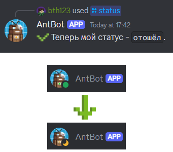

## edit
> Редактирует сообщение антбота
> ### Алиасы
> изменить, эдит, увше
> ### Использование
> `/edit {айди сообщения|ссылка на сообщение|ответ на сообщение} {отредактированный текст}`
> ### Пример
> - `/edit 1091671717111414905 gex`
> - (С ответом на сообщение) `/edit gex`
> 
> 

## ping
> Показывает задержку антбота
> ### Алиасы
> p, latency, пинг, п, з, зштп, дфеутсн
> ### Использование
> `/ping`
>
> 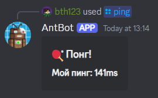

## say
> Отправляет сообщение от имени антбота
> ### Алиасы
> s, сказать, молвить, сей, сэй, ыфн, ы
> ### Использование
> `/say {текст}`

# Фановые

## enchant
> Переводит текст на язык стола зачарования (Standard Galactic Alphabet). Учтите, что если вы будете пробовать переводить кириллицу, команда сначала переведёт её в латиницу а уже потом на язык стола зачарования.
> ### Алиасы
> ench, енч, энч, зачаровать, зачарить, зачарь, зачаруй, утср, утсрфте
> ### Использование
> `/enchant {текст}`
> ### Пример
> `/enchant калдун это выдуманная абстрактная фигура, состоящая из 10 рублей`
> 
> 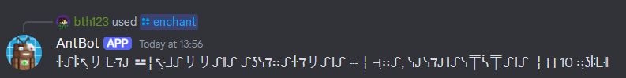

## unenchant
> Переводит текст с языка стола зачарования (Standard Galactic Alphabet)
> ### Алиасы
> unench, аненч, анэнч, раззачаровать, разчарить, разчарь, разчаруй, гтутср, гтутсрфте
> ### Использование
> `/unenchant {текст}`
> ### Пример
> `/unenchant ꖌ​ᔑ​ꖎ​↸​̣​リ​ ᒷ​ℸ​𝙹​ ⚍​╎​↸​̣​ᒲ​ᔑ​リ​リ​ᔑ​‖ᔑ​ ᔑ​ʖ​ᓭ​ℸ​∷​ᔑ​ꖌ​ℸ​リ​ᔑ​‖ᔑ​ ⎓​╎​⊣​̣​∷​ᔑ​, ᓭ​𝙹​ᓭ​ℸ​𝙹​‖ᔑ​ᓭ⍑ᓵ⍑​ᔑ​‖ᔑ​ ╎​⨅​ 10 ∷​̣​ʖ​ꖎ​ᒷ​‖​`
>
> 

## look-for
> Создаёт пост в канале `🔍・поиск-тимы` о поиске тиммейта
> ### Использование
> `/look-for [Баннер] {Название игры} {Описание}`
> ###  Пример
> `/look-for image.png
> майнкрафт
> Ищу тиммейта для игры на сервере
> Айпи сервера play.originrealms.com, только лицензия`
> 
> 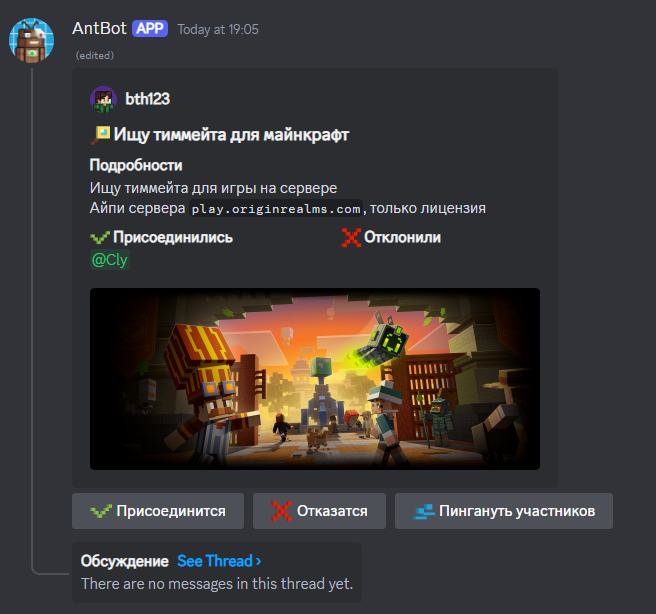

## giveaway
> Отправляет пост о розыгрыше на проверку модеарции, после которой отправляет его в канал `🎉・розыгрыши`
> ### Использование
> `/giveaway [Баннер] {Приз(ы)} {Описание} {Время, через которое он закончится} [Количество победителей (по дефолту 1)] [Доступ только по вайтлисту]`
> ### Пример
> /giveaway `Ключ к Minecraft Dungeons` `Учтите, что игра не для слабых пк, так что если вы не собираетесь играть со мной в эту игру, НЕ учавствуйте в конкурсе!` `1день 5ч`
>
> 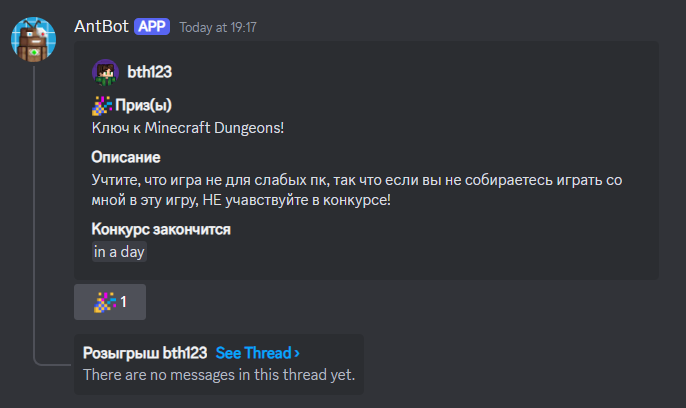
> 
## blacklist
> Позволяет манипулировать блэклистом розыгрыша. Должна быть отправлена в ветку розыгрыша его автором. При добавлении пользователя в блэклист он также исключается из списка участников
> ### Алиасы
> bl, бл, чс
> ### Использование
> `/blacklist {add|remove} {пользователь(и)}`
> ### Пример
> /blacklist add <@808665387142873108>
> 
> /blacklist remove <@808665387142873108> <@511049889371783180>
>
> 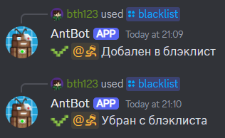
 
## whitelist
> Работает так же как blacklist, но позволяет манипулировать вайтлистом розыгрыша.
> ### Алиасы
> wl, вл, бс

# Общие команды

## remind
> Ставит напоминание, пингует пользователя по истечению заданного времени
> ### Алиасы
> reminder, rem, alarm, remind-me, remindme, напомнить, напоминатель, напомни, будильник, нап, куьштв, куьштвук, куь, фдфкь, куьштв-ьу, куьштвьу
> ### Использование
> `/remind {Время, через какое напомнить} {Что напомнить}`
> ### Пример
> /remind `5ч 15м` `Say gex`
>
> 

## transfer-ownership
> Передаёт права на голосовой канал другому пользователю. Комана должна быть отправлена в чат голосового канала
> ### Алиасы
> передать-права, to, пп
> ### Использование
> `/transfer-ownership {Пользователь}`
> ### Пример
> /transfer-ownership SuperAnt_
>
> /transfer-ownership <@536441049644793858>
>
> 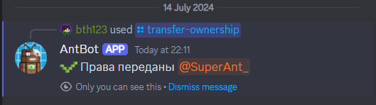

## idea
> Отправляет идею по серверу в `💡・идеи`
> ### Алиасы
> швуф, идея, suggest, предложить, ыгппуые
> ### Использование
> `/idea {идея}`
> ### Пример
> /idea `Добавить канал для сэйгексинга`
>
> 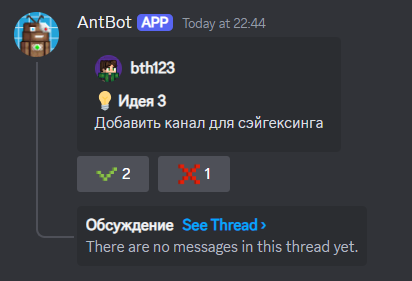

# Команды помощи

## resolve
> Архивирует пост помощи, оставляя ссылку на сообщение с решением проблемы и упомянания людей которые помогли. Так же можно заархивировать ветку без решения проблемы
> ### Алиасы
> solve, ыщдму, куыщдму, решено, ресолв, солв
> ### Использование
> `/resolve [Ссылка|айди сообщения с решением проблемы] [Пользователь(и) которые помогли]`
> ### Пример
> /resolve `https://discord.com/channels/1097272592676700250/1262127423294672906/1262127471256403968` `<@536441049644793858>`
>
> 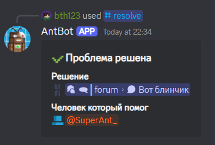

## syntax
> Показывает синтаксис ванильных команд и ссылку на вики о кмоанде
> ### Алиасы
> stx, ынтефч, ыея, синтакс, синтаксис, сткс
> ### Использование
> `/syntax {команда}`
> ### Пример
> /syntax damage
>
> 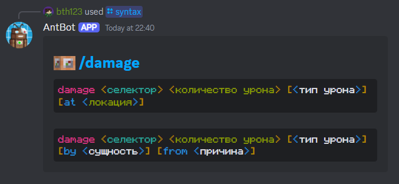

# Майнкрафтовские

## packformat
> Выдаёт актуальные числа, которые соответствуют версиям в pack_format
> ### Алиасы
> mcmetaformat, pack-format, pack_format, packmcmetaformat, pf, пакформат, пак-формат, пак_формат, мсметаформат, пакмсметаформат, пф, зфслащкьфе, за
> ### Использование
> `/packformat э она переписана будет, потом напишу`

## template
> Создаёт шаблон датапака/ресурспака
> ### Алиасы
> tl, темплейт, тэмплейт, еуьздфеу, шаблон
> ### Использование
> `/template [Датапак|Ресурспак] [Базовый|Расширенный|Настраиваемый]`
> 
> Аргументы настраиваемого пака: {Название пака} [Неймспейсы] [Включить папки в пак (function/loot_table) (все по дефолту)] [Исключить папки в паке (function/loot_table)] [Версия (последння по дефолту)]
> ### Пример
> /template `custom` `-` `bth` `function loot_table damage_type` `-` `-`
>
> 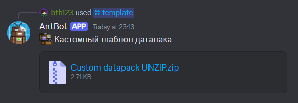

# Модераторские

## clear
> Очищает заданное количество сообщений
> ### Алиасы
> сдуфк, клир, очистить
> ### Использование
> `/clear {количество сообщений} [канал (по дефолту текущий)]`
> ### Пример
> /clear 16

## ban
> ### Алиасы
> ифт, бан, банчек, заблокировать
> ### Использование
> `!ban {Пользователь} [Причина]`
>
> 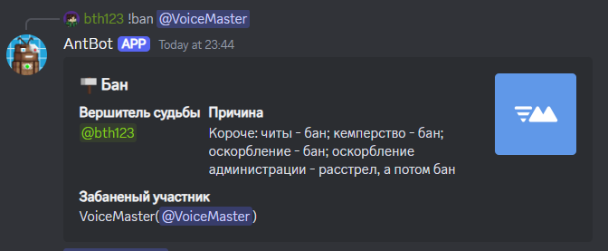

## kick
> ### Алиасы
> лшсл, кик, изгнать
> ### Использование
> `!kick {Пользователь} [Причина]`
>
> 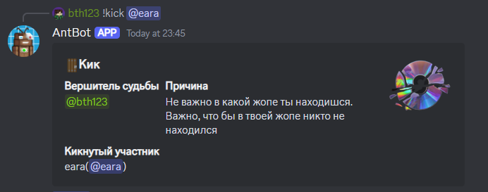

## mute
> ### Алиасы
> ьгеу, мут
> ### Использование
> `!mute {Пользователь} {Время} [Причина]`
>
> 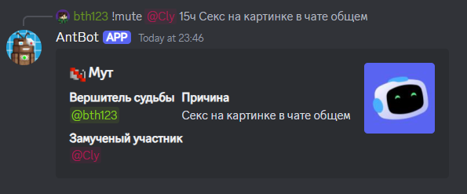