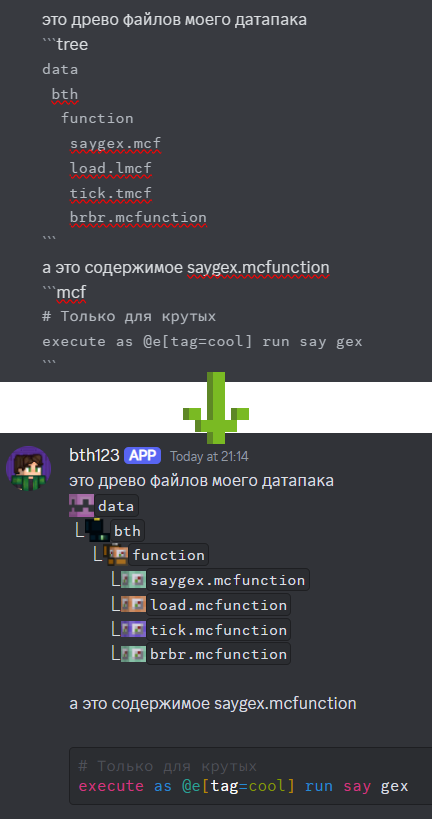
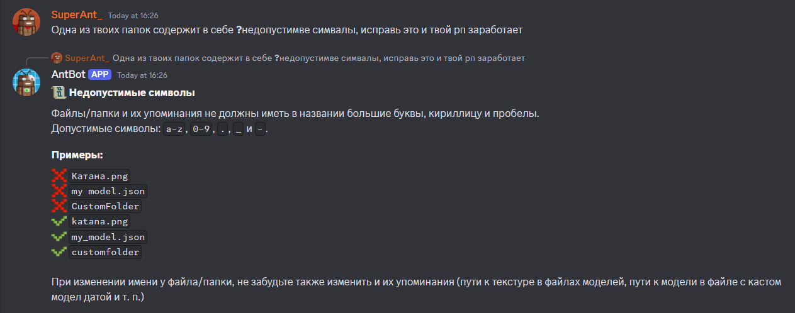

# Отдельные фичи Антбота
## Закреп в своих ветках помощи/творчества
> ### Использование
> Отреагируйте на желаемое сообщение с помощью эмодзи `📌`

## Форматтер
> Форматтер - это система форматирования сообщений, которая отправляет отформатированные сообщения с помощью вебхуков, которые имитируют профиль пользователя. 
> ### Использование
> - Блок кода `mcf` подсветит команды внутри него красивым образом, как в VS Code, используя ANSI.
> - Блок кода `tree` позволяет создать древо файлов датапака/ресурспака, подобно тому, как это выглядит в VS Code, используя расширение [Datapack Icons](https://marketplace.visualstudio.com/items?itemName=SuperAnt.mc-dp-icons). Каждый пробел перед названием файла/папки - 1 уровень глубины древа. А так же как видно на скриншоте, существуют расширения, которые при форматировании становятся `mcfunction`, но имеют разные иконки:
>   - `mcf` алиас `mcfunction`
>   - `tmcf` используется для обозначения тик функций
>   - `lmcf` используется для обозначения лоад функций
> 
> 

## Система собственных голосовых каналов
> ### Использование
> Чтобы создать свой голосовой канал, нужно просто зайти в канал `➕・создать`. После этого вас перебросит в новосозданный голосовой канал, в котором у вас уже будут все права на его редактирование и модерирование. Чтобы передать кому то эти права, нужно использовать команду [`transfer-ownership`](и тут ссылка типа на команду да)
> 
> 

## FAQшки
> Система факьюшек быстро получить полезную информацию о многих вещах, чтоб не приходилось объяснять людям по многу раз одно и то же.
> ### Использование
> Пропишите команду [`!faqs`](и тут ссылка на типа на команду да), чтоб получить список всех доступных факьюшек.
> Чтобы вызвать ответ на какую-либо факьюшку, напишите вопросительный знак и после него название факьюшки. Чтоб вызвать факьюшку всередине сообщения, сделав вопросительный знак жирным с помощью двух звёздочек по обе его стороны. У каждой факьюшки есть много алиасов, и их можно посмотреть, прописав `!faqs <факьюшка>`. Система факьюшек также будет работать, если вы совершите ошибки в написании названий/алиасов факьюшек. Чем длиннее название/алиас - тем больше ошибок вы можете совершить.
